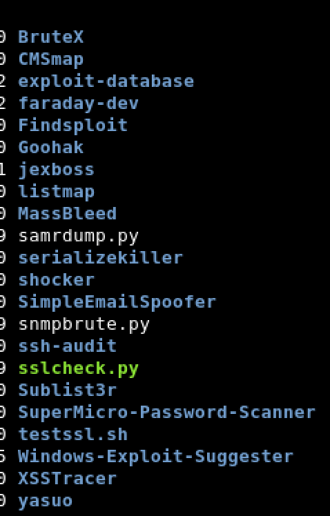
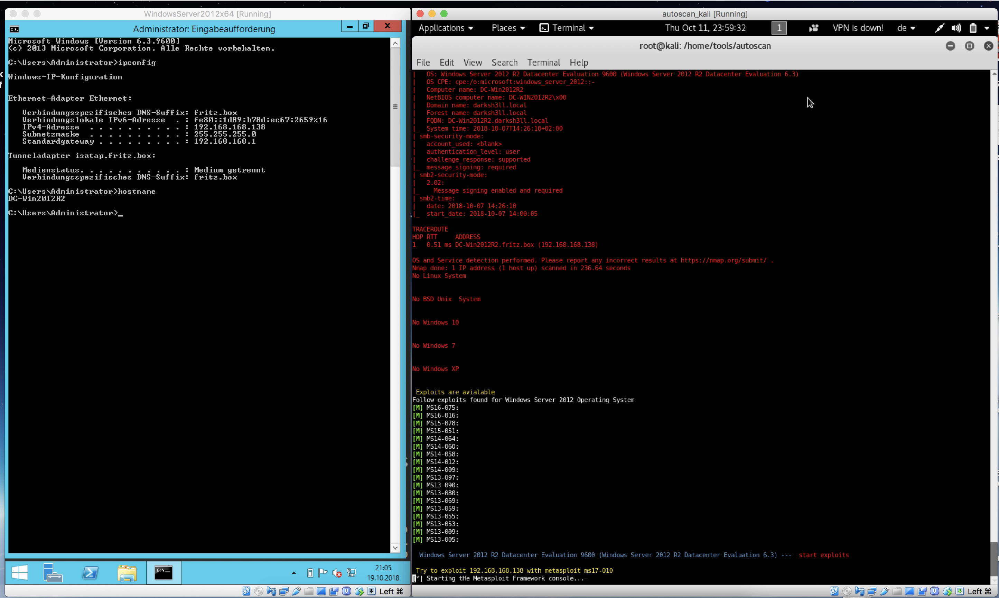
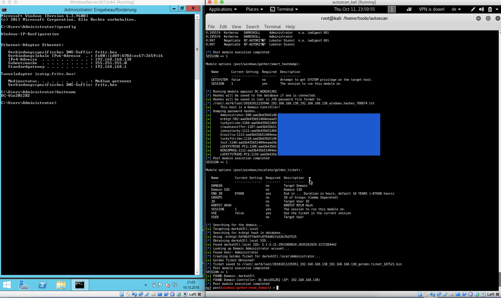

# autoscan #
# Automated Scanning, Pentesting , Exploiting and Reporting
#
# Overview
# autoscan.sh 
is fully automated penetration test tool linked with Metasploit.
Autoscan identifies the status of all opened ports on the target server and executes the exploit.
# Other tools
Brutex
CMSmap
explit-database
Findsploit
Goohak
listmap
MassBled
serializekiller
shoker
ssh-audit
Sublist3r
testssl
Windows-Exploit-Suggester
XSSTracer
yasuo
arachni
wpscan
...
..
.
#
# Reporting
For Reporting you need a comercial license from Farady. This tool never include a Faraday license.
For more informations about faraday, please contact the faraday team.
#
# Install and execute
You need before use it, install some tools. The most of this tools are installed in Kali Linux
This script are testet with Kali Linux. 
Installscript exist, but is in development, if you use it, you use it at your own risk.
Download the scripts to /home/tools/autoscan. If the directory dont exist, make it.
Clone the repository in this folder.
Scaned all TCP ports, and the most used UDP Ports.
#
# Windows
This script use standard exploits to exploit Windows Server 2012, Win7, WinXP and other Windows based OS, Websites and CMS systems and other services.
#
# Linux
The functionality exploiting remote unixoide OS systems are in progress.
But, many services enumerated and exploited also if the server is a linux host.
#
# Development
New tools are work in progress.
This tools at the moment have issues, so I never give a garanty for work without errors.
If you use it, you use it at your own risk.
# Webinterface
Exist, is a simple PHP Script, in development.
#
# Video
Yes, not in youtube :-)
#
# Images
#

#

#

#

#

#

# 
